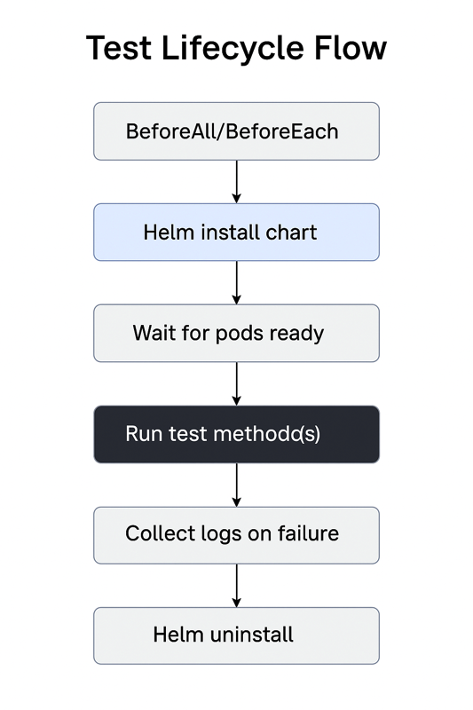
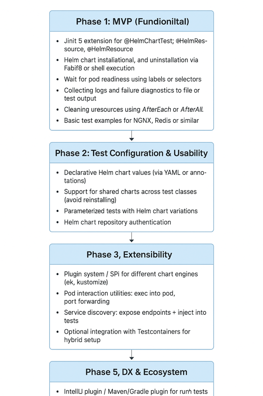

# HelmJUnit Documentation

## 📘 Overview

HelmJUnit is a JUnit 5 extension for running integration tests against applications deployed via Helm on Kubernetes. It helps Java developers write realistic tests by automatically managing Helm chart deployments, waiting for readiness, exposing service access, and cleaning up Kubernetes resources after test execution.

---

## ✅ Use Cases

### 1. **End-to-End Tests for Microservices**

* Spin up the full stack using Helm (e.g., app + DB)
* Validate API responses, database interactions, and inter-service communication
* Simulate real-world deployments on CI

### 2. **Pre-Merge Kubernetes Validation**

* Run tests during CI to verify Helm chart changes
* Validate that services start correctly and expose required ports
* Check that all pods become ready within acceptable time

### 3. **Integration Testing for Controllers/Operators**

* Deploy Helm-based resources for CRD-based controllers
* Test reconciliation logic using real resources

### 4. **Platform Testing for Custom Charts**

* Validate your company’s Helm charts using real services
* Ensure common configurations like ingress and secrets work end-to-end

### 5. **Testing on Ephemeral Clusters (e.g., kind)**

* Use HelmJUnit with kind or minikube to run lightweight test environments
* Zero cluster configuration required in tests

### 6. **Real-World Use Case: Microservice with Redis & PostgreSQL**

**Scenario:** A microservice relies on Redis and PostgreSQL. Devs want integration tests that verify this interaction before merging code.

**Solution with HelmJUnit:**

* Deploy Redis and PostgreSQL via Helm in the test lifecycle.
* Wait for services to become ready.
* Allow test code to access these services via port forwarding.

```java
@HelmDeploy(chart = "bitnami/redis", namespace = "test")
@HelmDeploy(chart = "bitnami/postgresql", namespace = "test")
class OrderServiceIT {

  @Test
  void shouldStoreOrderInPostgresAndEmitEventToRedis() {
    // Use JDBC and Redis client to perform assertions
  }
}
```

### 7. **Real-World Use Case: Validating Helm Charts in CI**

**Scenario:** Platform team needs to verify a Helm chart’s quality and readiness logic.

**Solution with HelmJUnit:**

* Deploy the chart as part of a CI job.
* Ensure all pods are ready.
* Confirm endpoints are reachable.

```java
@HelmDeploy(chart = "../charts/my-app", namespace = "test", wait = true)
class HelmChartValidationIT {

  @Test
  void shouldReachReadyStateAndExposeHttpPort() {
    String baseUrl = TestServiceAccess.url("my-app", 8080);
    HttpResponse res = Http.get(baseUrl + "/health");
    assertEquals(200, res.statusCode());
  }
}
```

---

## ⚙️ How It Works

### Lifecycle Diagram

```

```

### System Architecture

```
JUnit 5 Extension
     │
     ├─> Kubernetes Client (Fabric8)
     ├─> Helm CLI wrapper (ProcessBuilder)
     └─> Port Forward Manager
            └──> expose service URLs to test code
```

### Developer Flow

```
Write Test -> Annotate with @HelmDeploy -> Run tests -> App deployed to K8s -> Test runs -> App destroyed
```

---

## 🏗️ Proposed Implementation

### Technologies

* **JUnit 5 Extension API**
* **Fabric8 Kubernetes Client**
* **Helm CLI via ProcessBuilder**
* **OkHttp or Java HTTP Client** for service interaction

### Key Components

1. `@HelmDeploy` – Declares chart location, namespace, and config.
2. `HelmTestExtension` – JUnit 5 lifecycle integration.
3. `KubernetesHelper` – Handles pod readiness, logs, and services.
4. `HelmClient` – Wrapper around Helm CLI.
5. `TestServiceAccess` – Helps form URLs for service access.

---

## 📓 Developer Notes

* Follow JUnit 5 extension model for test lifecycle.
* Implement Helm CLI wrapper that uses `ProcessBuilder`.
* Use Fabric8 for pod/service readiness checks.
* Track all deployed namespaces/charts to ensure cleanup.
* Support values files, wait flags, and multiple charts.

---

## 🗺️ Roadmap

### ✅ Phase 1: MVP (Minimum Viable Product)

* **JUnit 5 Extension Scaffolding**: Build basic `@HelmDeploy` and `HelmTestExtension` with support for `BeforeEachCallback`, `AfterEachCallback`, etc.
* **Helm Chart Installation**: Use Helm CLI to install and uninstall charts from local or remote sources.
* **Kubernetes Readiness Probes**: Wait for all pods to become ready using Fabric8 based on label selectors.
* **Service Access via Port Forwarding**: Enable test code to connect to internal Kubernetes services via ephemeral port forwarding.
* **Log Collection**: On test failure, capture pod logs and Kubernetes events to assist debugging.
* **Resource Cleanup**: Automatically uninstall Helm releases and delete namespaces if created for test.

### 🔄 Phase 2: Enhanced Usability

* **Declarative YAML Values**: Allow values to be loaded from YAML files or inlined.
* **Reusable Shared Charts**: Avoid reinstalling common charts between test methods/classes using a cache mechanism.
* **Parameterized Chart Tests**: Run the same tests across multiple Helm configurations.
* **Private Repo Support**: Authenticate against private chart repositories using Helm credentials.

### 📦 Phase 3: Extensibility

* **Kustomize or CRD Support**: Add hooks to support non-Helm resources, like Kustomize or raw manifests.
* **Pod Execution Utilities**: Provide `kubectl exec`-like functionality from test code.
* **Service Discovery Helpers**: Inject internal DNS/service names into test logic automatically.
* **Hybrid Test Container Integration**: Combine HelmJUnit with Testcontainers for database or browser testing.

### 🌐 Phase 4: Observability and CI Integration

* **JUnit Report Output**: Enrich test results with Helm metadata, logs, and failure diagnostics.
* **Kubernetes Event Dump**: On test failure, store events and describe pod output.
* **GitHub Actions Examples**: Provide ready-to-use CI templates for users.
* **Optional Visual Monitoring**: Add browser snapshots or UI tests via Playwright/WebDriver.

### 🚀 Phase 5: Developer Experience (DX)

* **IDE Integration**: Build IntelliJ plugin to visualize charts under test or interact with cluster.
* **Gradle/Maven Plugin**: Offer a plugin to wrap tests with setup/teardown tasks.
* **Declarative Java DSL**: Create fluent DSL for inline Helm scenarios without annotations.
* **Documentation Website**: Launch a clean, searchable site with live demos and usage guides.
* **v1.0.0 Release**: Package stable features, write release notes, and launch publicly.


---

## 📣 Feedback & Contributions

This project is in early development. If you’d like to test, suggest features, or contribute code/docs, please open an issue or discussion!
