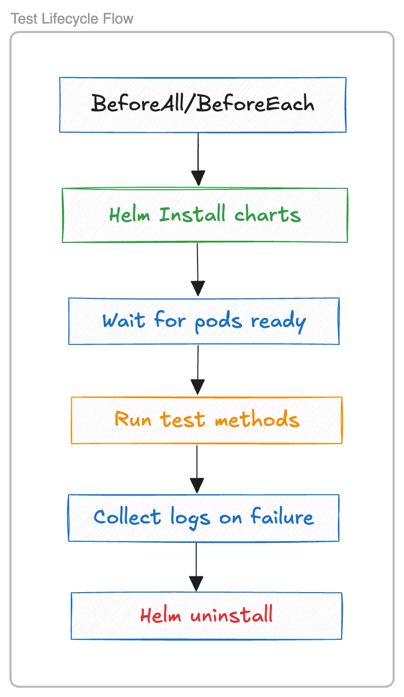

# HelmJUnit Documentation

## 📘 Overview

HelmJUnit is a JUnit 5 extension for running integration tests against applications deployed via Helm on Kubernetes. It helps Java developers write realistic tests by automatically managing Helm chart deployments, waiting for readiness, exposing service access via port forwarding, injecting service metadata into test classes, and cleaning up Kubernetes resources after test execution.

---

## ✅ Use Cases

### 1. **End-to-End Tests for Microservices**

* Spin up the full stack using Helm (e.g., app + DB)
* Validate API responses, database interactions, and inter-service communication
* Simulate real-world deployments on CI

### 2. **Pre-Merge Kubernetes Validation**

* Run tests during CI to verify Helm chart changes
* Validate that services start correctly and expose required ports
* Check that all pods become ready within acceptable time

### 3. **Integration Testing for Controllers/Operators**

* Deploy Helm-based resources for CRD-based controllers
* Test reconciliation logic using real resources

### 4. **Platform Testing for Custom Charts**

* Validate your company’s Helm charts using real services
* Ensure common configurations like ingress and secrets work end-to-end

### 5. **Testing on Ephemeral Clusters (e.g., kind)**

* Use HelmJUnit with kind or minikube to run lightweight test environments
* Zero cluster configuration required in tests

### 6. **Real-World Use Case: Microservice with Redis & PostgreSQL**

**Scenario:** A microservice relies on Redis and PostgreSQL. Devs want integration tests that verify this interaction before merging code.

**Solution with HelmJUnit:**

* Deploy Redis and PostgreSQL via Helm in the test lifecycle.
* Wait for services to become ready.
* Allow test code to access these services via port forwarding.

```java
@HelmChartTest
public class OrderServiceIT {

    @HelmResource(chart = "bitnami/redis", releaseName = "redis", namespace = "test")
    HelmRelease redis;

    @HelmResource(chart = "bitnami/postgresql", releaseName = "postgres", namespace = "test")
    HelmRelease postgres;

    @Test
    void shouldStoreOrderInPostgresAndEmitEventToRedis() {
        // Use postgres.getNamespace(), redis.getServiceName(), etc.
    }
}
```

### 7. **Real-World Use Case: Validating Helm Charts in CI**

**Scenario:** Platform team needs to verify a Helm chart’s quality and readiness logic.

**Solution with HelmJUnit:**

* Deploy the chart as part of a CI job.
* Ensure all pods are ready.
* Confirm endpoints are reachable.

```java
@HelmChartTest
class HelmChartValidationIT {

    @HelmResource(chart = "../charts/my-app", releaseName = "my-app", namespace = "test")
    HelmRelease app;

    @Test
    void shouldReachReadyStateAndExposeHttpPort() {
        try (PortForwardManager pf = new PortForwardManager("svc/" + app.getServiceName(), app.getServicePort(), app.getNamespace())) {
            String url = pf.getLocalUrl();
            HttpResponse<String> res = HttpClient.newHttpClient()
                    .send(HttpRequest.newBuilder().uri(URI.create(url + "/health")).build(),
                            HttpResponse.BodyHandlers.ofString());

            assertEquals(200, res.statusCode());
        }
    }
}
```

### 8. **Real-World Use Case: Injecting HelmRelease for Validation**

**Scenario:** Developers want to validate that a Helm chart is deployed correctly and its services are accessible.

**Solution with HelmJUnit:**

* Use the `@HelmResource` annotation to deploy a Helm chart and inject the resulting `HelmRelease` object.
* Perform assertions on the injected handle or use it for port forwarding.

```java
@HelmChartTest
public class HelmReleaseTest {

    @HelmResource(chart = "bitnami/nginx", releaseName = "nginx-port", namespace = "nginx-port-ns")
    HelmRelease nginx;

    @Test
    void testHandleInjectedCorrectly() {
        assertNotNull(nginx);
        assertEquals("nginx-port", nginx.getReleaseName());
        assertEquals("nginx-port-ns", nginx.getNamespace());
        assertEquals("nginx-port", nginx.getServiceName());
        assertTrue(nginx.getServicePort() > 0);
    }
}
```

---

## 💡 Optional DSL-Based Usage (No Annotations)

HelmJUnit supports fluent Java DSL-based testing for maximum flexibility.

### ✅ Single-Chart DSL Example

```java
HelmTestRunner.deploy()
    .chart("bitnami/redis")
    .releaseName("redis-dsl")
    .namespace("showcase")
    .set("architecture=standalone")
    .set("auth.enabled=false")
    .run(env -> {
        assertEquals("redis-dsl", env.getReleaseName());
        assertNotNull(env.getServiceName());
        assertTrue(env.getServicePort() > 0);
    });
```

### ✅ Multi-Chart DSL Example

```java
HelmTestRunner.deploy()
    .add(c -> c.chart("bitnami/redis")
               .releaseName("redis")
               .namespace("showcase")
               .set("auth.enabled=false"))
    .add(c -> c.chart("bitnami/postgresql")
               .releaseName("postgres")
               .namespace("showcase")
               .set("auth.postgresqlPassword=secret"))
    .run(releases -> {
        HelmRelease redis = releases.get("redis");
        HelmRelease postgres = releases.get("postgres");
        assertNotNull(redis.getServiceName());
        assertNotNull(postgres.getServiceName());
    });
```

---

## ⚙️ How It Works

### Lifecycle Diagram



### System Architecture

```
JUnit 5 Extension
     │
     ├─> HelmClient (wraps Helm CLI via ProcessBuilder)
     ├─> Pod and Service readiness via kubectl
     └─> PortForwardManager
            └──> exposes service URLs to test code
```

### Developer Flow

```
Write Test -> Annotate with @HelmResource OR use DSL -> Test runs -> Helm install -> Wait for pods -> Inject handles -> Access service -> Helm uninstall
```

---

## 🏗️ Implementation Summary

### Technologies

* **JUnit 5 Extension API**
* **Helm CLI via ProcessBuilder**
* **kubectl for pod/service status and logs**
* **Java HTTP Client** for service testing

### Key Components

1. `@HelmChartTest` – Marks test classes using HelmJUnit.
2. `@HelmResource` – Declares chart and test resource metadata.
3. `HelmChartTestExtension` – JUnit 5 extension that installs, waits, injects, and cleans up.
4. `HelmClient` – Wrapper around Helm install/uninstall and readiness logic.
5. `PortForwardManager` – Handles temporary port forwarding to access cluster-internal services.
6. `HelmRelease` – Injected object giving service access metadata to the test.
7. `HelmTestRunner` – DSL entry point for programmatic test flows.

---

## 📓 Developer Notes

* Follow JUnit 5 lifecycle separation: install in `BeforeAll`, inject in `BeforeEach`.
* Automatically extract service ports using `kubectl get svc` or Helm manifest parsing.
* Inject `HelmRelease` with releaseName, namespace, serviceName, and resolved port.
* Port forward dynamically selected local ports for service testing.
* Support YAML value files and inline key-values.
* DSL supports both single and multi-chart flows.

---

## 🗺️ Roadmap

### ✅ Phase 1: MVP (Minimum Viable Product)

* ✅ JUnit 5 Extension scaffolding (`@HelmChartTest`, `@HelmResource`)
* ✅ Helm CLI integration with install/uninstall logic
* ✅ Pod readiness and Helm retries with timeouts
* ✅ Injected `HelmRelease` into test instance
* ✅ Service port extraction from Kubernetes
* ✅ Port forwarding utility for service access
* ✅ Resource cleanup after test (uninstall + namespace delete)

### 🔄 Phase 2: Enhanced Usability

* **Declarative YAML Values**: Allow values to be loaded from YAML files or inlined.
* **Reusable Shared Charts**: Avoid reinstalling common charts between test methods/classes using a cache mechanism.
* **Parameterized Chart Tests**: Run the same tests across multiple Helm configurations.
* **Private Repo Support**: Authenticate against private chart repositories using Helm credentials.

### 📦 Phase 3: Extensibility

* **Kustomize or CRD Support**: Add hooks to support non-Helm resources, like Kustomize or raw manifests.
* **Pod Execution Utilities**: Provide `kubectl exec`-like functionality from test code.
* **Service Discovery Helpers**: Inject internal DNS/service names into test logic automatically.
* **Hybrid Test Container Integration**: Combine HelmJUnit with Testcontainers for database or browser testing.

### 🌐 Phase 4: Observability and CI Integration

* **JUnit Report Output**: Enrich test results with Helm metadata, logs, and failure diagnostics.
* **Kubernetes Event Dump**: On test failure, store events and describe pod output.
* **GitHub Actions Examples**: Provide ready-to-use CI templates for users.

### 🚀 Phase 5: Developer Experience (DX)

* **IDE Integration**: Build IntelliJ plugin to visualize charts under test or interact with cluster.
* **Gradle/Maven Plugin**: Offer a plugin to wrap tests with setup/teardown tasks.
* **Declarative Java DSL**: Create fluent DSL for inline Helm scenarios without annotations.
* **Documentation Website**: Launch a clean, searchable site with live demos and usage guides.
* **v1.0.0 Release**: Package stable features, write release notes, and launch publicly.

---

## 📣 Feedback & Contributions

This project is in early development. If you’d like to test, suggest features, or contribute code/docs, please open an issue or discussion!
